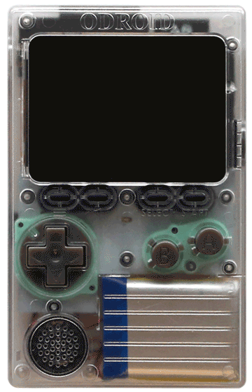

# 
> # 🎮 RetroESP32 (Revived) - Rev 2.9
>
> A complete revival of RetroESP32 , PSRAM fixes, new emulators, upgraded GUI for the launcher, save\load for all emulators, fail safe option, paddle support for Atari 2600 and 800\5200 (**It only support the original Odroid GO and cloans**).

| Retro ESP32 In Action                                    | Summary                                                      |
| -------------------------------------------------------- | ------------------------------------------------------------ |
|  | <br/><br/>**Retro ESP32** is the ultimate feature packed [Odroid Go](https://www.hardkernel.com/shop/odroid-go/) Launcher. <br/><br/>Includes color schemes and theming. <br/>Drawing inspiration from the popular [RetroArch](https://www.retroarch.com/) emulator front end of choice. <br/>We packed 13 (current count) prebundled emulators including ROM / Game manager. <br/>Additionally each emulator includes an in game menu for further management.<br/><br/>**[Get Your Copy Today](https://github.com/retro-esp32/RetroESP32/releases)** |
|                                                          |                                                              |

## Preparation
> Update Odroid Go Firmware

This only applies to owners of the Hardkernel [Odroid Go](https://www.hardkernel.com/shop/odroid-go/)  *NOT the Retro ESP32*

## Installation
> Copy, Mount, Flash

We kept installation of Retro ESP32 super simple.
1. Downloads the latest [release](https://github.com/retro-esp32/RetroESP32/releases)
2. Copy **RetroESP32.fw** to the **odroid/firmware** folder of your prepared [SD card](https://github.com/retro-esp32/RetroESP32/blob/Software/SD%20Card/SDCARD.zip)
4. Mount the SD Card back into your Odroid Go
5. Restart Holding the **B** button
6. Select **Retro ESP32** from the firmware list
7. Sit back and relax while your Odroid Go flashes the new firmware

## Supported Emulators
> What else do you need to know

- [x] Nintendo Entertainment System

- [x] Nintendo Game Boy

- [x] Nintendo Game Boy Color

- [x] Sega Master System

- [x] Sega Game Gear

- [x] Colecovision

- [x] Sinclair Zx Spectrum 48k

- [x] Atari 2600 (With paddle support via IO15)

- [x] Atari 7800

- [x] Atari 800XL\5200 (With paddle support via IO15)

- [x] Atari Lynx

- [x] PC Engine

- [x] OpenTyrian (Tyrian — arcade vertical scrolling shooter) - Part of the whole package

  ## 🕹️ Atari Paddle Support

  Connect a potentiometer:

  ```
  3.3V ─────┐
            ├── IO15 (wiper)
  GND  ─────┘
  ```

  🔁 If direction is reversed → swap 3.3V and GND

## Features
> What makes Retro ESP32 different

- [x] Configurator
- [x] Themes (color pack and icons)
- [x] RetroArch like GUI experience
- [x] In game HUD menu
- [x] **Recently Played** *(First in Launchers Community)*
- [x] **Favorites List** *(Another First)


-----

## ✨ What’s New

### 🔧 Modernized Core

- Fixed **new PSRAM compatibility issues**
- Enables building modern hardware (Odroid-Go style clones)

------

### 🖥️ Improved Launcher

- 📂 **Sorted game list**
- 📄 **Paging support (Page Up / Down)**
- ⚡ Faster and smoother browsing

------

### 🕹️ Expanded Emulator Support

- ➕ Atari **800XL / 5200**
- ➕ **OpenTyrian**
- 🎯 Broader system compatibility

------

### 💾 Save / Load Everywhere

- Added to **all emulators**
- Fixed missing functionality in legacy cores

------

### 🛡️ Fail-Safe Boot (Critical Fix)

- Hold **A button during boot → force launcher**
- Prevents **infinite reset loop** caused by bad ROMs
- Fixes one of the biggest issues in the original project

## Have your say!

> Don't be shy, our team is here

*Have a great idea? Want to see a feature? Ran into a problem?*
Use our [Project](https://github.com/retro-esp32/RetroESP32/projects/1) and [Issue](https://github.com/retro-esp32/RetroESP32/issues) sections to have your say.


## Authors

* **Eugene Yevhen Andruszczenko** - *Initial and Ongoing Work* - [32teeth](https://github.com/32teeth)
* **Fuji Pebri** - *Espressif IOT Consultant* - [pebri86](https://github.com/pebri86)
* **Gil Tal** - Just revived it and improvements

### License

This project is licensed under the Creative Commons Attribution Share Alike 4.0 International - see the [LICENSE.md](LICENSE.md) file for details

### Acknowledgments

* [othercrashoverride](https://github.com/othercrashoverride)
* [pelle7](https://github.com/pelle7)
* [pebri86](https://github.com/pebri86)
* [hardkernel](https://github.com/hardkernel)
* [ducalex](https://github.com/ducalex/)